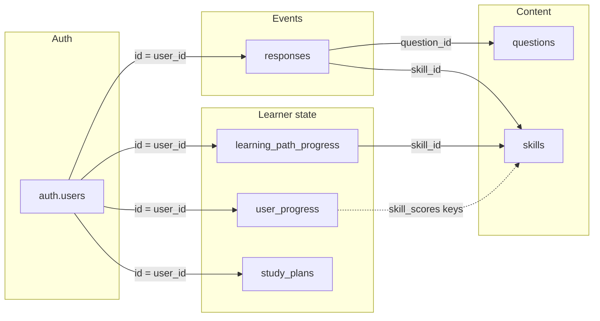

# Analytics data inventory

**Purpose:** Describe what the app collects, where it lives, and how pieces link together for analytics, BI exports, or warehouse modeling.

**Source of truth:** Current code and `supabase/migrations/*.sql`. If a table or column changes, update this doc in the same change.

---

## 1. Primary join key

Almost all learner data hangs off Supabase **`auth.users.id`** (UUID), exposed in the app as the signed-in user’s `user.id`.

| Store | User key column / field |
|--------|-------------------------|
| `user_progress` | `user_id` → `auth.users(id)` |
| `responses` | `user_id` |
| `learning_path_progress` | `user_id` |
| `study_plans` | `user_id` |
| `question_reports` | `user_id` (nullable on delete) |
| `beta_feedback` | `user_id` (nullable on delete) |
| `practice_responses` | `user_id` (schema exists; see §3) |
| `questions` / `skills` | Content keys `id`, not user-specific |

---

## 2. Supabase tables (server-side, queryable)

### 2.1 `user_progress`

Rolling **profile + aggregated progress** for each learner. One row per user.

**High-value analytics fields**

| Column(s) | Meaning | Relates to |
|-------------|---------|------------|
| `email`, `display_name` | Identity mirrors | `auth.users` |
| `login_count`, `last login_at`, `last_active_at` | Engagement | Updated on sign-in (`AuthContext`) |
| `screener_complete`, `diagnostic_complete`, `full_assessment_complete` | Funnel stage | `responses` by `assessment_type` |
| `domain_scores`, `skill_scores` | Cached accuracy / attempts per domain & skill | Rebuilt from `responses`; aligns with `src/utils/skillProficiency.ts` for UI thresholds |
| `global_scores` | Cross-assessment summary blob | Derived from `responses` + calculators |
| `weakest_domains`, `factual_gaps`, `error_patterns` | Text/list signals | Often study-plan / UI inputs |
| `total_questions_seen`, `practice_response_count`, `streak` | Volume & streak | `responses`; streak also updated on practice save |
| `last_session`, `last_*_session_id` | Resume pointers | Session groups in `responses` |
| `screener_item_ids`, `full_assessment_question_ids`, `recent_practice_question_ids`, `screener_results` | Which items / summaries | Question ids → `questions.id` |
| Onboarding columns (`account_role`, `university`, `planned_test_date`, `study_goals`, …) | Segmentation | See migration `0002_user_profile_fields.sql` |
| `onboarding_complete` | Onboarding funnel | — |

**Code anchors:** `src/hooks/useFirebaseProgress.ts` (load/save profile), `src/contexts/AuthContext.tsx` (login metrics).

---

### 2.2 `responses`

**Event-level truth** for assessments and practice: one row per submitted answer (canonical path for practice since `savePracticeResponse` writes here only).

| Column | Meaning | Relates to |
|--------|---------|------------|
| `session_id` | Groups an assessment or practice run | Same user: all rows with same `session_id` are one sitting |
| `question_id` | Item id | `questions.id` (DB or bundled JSON) |
| `skill_id`, `domain_id`, `domain_ids` | Taxonomy | `skills.id`, domain integers in content |
| `assessment_type` | `'screener' \| 'full' \| 'practice' \| 'diagnostic'` | Filtering funnels & modes |
| `is_correct`, `confidence`, `time_spent`, `time_on_item_seconds` | Outcome & behavior | — |
| `selected_answers`, `correct_answers` | Choices | — |
| `distractor_pattern_id` | Misconception tagging | Skill / item design |
| `created_at` | Event time | Sequencing, cohorts |

**Typical joins**

```sql
-- Enrich events with item metadata (when `questions` is populated)
SELECT r.*, q.domain, q.skill_id AS q_skill, q.question_stem
FROM responses r
LEFT JOIN questions q ON q.id = r.question_id
WHERE r.user_id = $1;
```

**Code anchors:** `useFirebaseProgress.logResponse`, `savePracticeResponse`, `saveScreenerResponse`; assessment and practice components.

---

### 2.3 `learning_path_progress`

Per-user, per-**skill** learning-path state (lesson viewed, time, module quiz aggregates). **Separate** from `user_progress.skill_scores`: LP status is path-specific; overall practice accuracy still lives in `user_progress` / global derivations.

| Column | Meaning | Relates to |
|--------|---------|------------|
| `skill_id` | Taxonomy skill | `skills.id`, question `skill_id` |
| `lesson_viewed`, `time_spent_seconds`, `lesson_completed_at` | Lesson engagement | — |
| `questions_submitted`, `questions_correct`, `questions_total`, `accuracy` | Embedded LP quiz | — |
| `status` | `not_started` … `mastered` | App-derived; see `useLearningPathSupabase.ts` |

**Code anchors:** `src/hooks/useLearningPathSupabase.ts`, `LearningPathModulePage.tsx`.

---

### 2.4 `study_plans`

AI-generated plan documents.

| Column | Meaning | Relates to |
|--------|---------|------------|
| `plan_document` | JSON (schema v2: `schemaVersion: "2"`) | Built from `user_progress` + `responses` + preprocessors; narrative sections for analytics mining |
| `created_at`, `updated_at` | Generation history | Rate limits in `studyPlanService` |

**Code anchors:** `api/study-plan-background.ts`, `src/services/studyPlanService.ts`.

---

### 2.5 `questions` and `skills`

**Content catalog** optionally synced in Supabase (app falls back to bundled JSON if empty).

Use these to denormalize analytics on `question_id` / `skill_id` (domain weights, labels, complexity).

---

### 2.6 `question_reports` and `beta_feedback`

Qualitative / support analytics: user-reported issues and beta messages (category, page, `app_version`, etc.).

**Code anchors:** `src/hooks/useQuestionReports.ts`, `src/hooks/useBetaFeedback.ts`, `src/utils/feedbackAudit.ts`, `AdminDashboard.tsx`.

---

### 2.7 `practice_responses`

Defined in **`0000_initial_schema.sql`**. Current **`savePracticeResponse`** intentionally writes only to **`responses`** with `assessment_type = 'practice'` (see comment in `useFirebaseProgress.ts`). Treat `practice_responses` as **legacy / empty for new data** unless you re-enable writes.

---

## 3. Browser-only data (not in Supabase)

Per-device; **not** suitable for server-side cohort analytics without a future sync pipeline.

| Key / pattern | Data | Used for |
|---------------|------|----------|
| `pmp-daily-q-{userId}-{YYYY-MM-DD}` | Questions answered that day | `useDailyQuestionCount`, `useWeeklyMomentum` |
| `pmp-daily-time-{userId}-{YYYY-MM-DD}` | Study seconds that day | `useDailyStudyTime` |
| `pmp-spicy-cycle-{userId}` | Spicy mode skill order + index | `PracticeSession` |
| `pmp-qretire-{userId}` | Question retirement map | `PracticeSession` |
| `practice-stats-{sessionId}` | In-session stats cache | `PracticeSession` |
| `pmp-lp-{userId}` | Learning path **module** view + seconds (parallel to LP table) | `useLearningPathProgress` / `SkillHelpDrawer` / `LearningPathModulePage` |
| `praxis-session-*`, `praxis-user-sessions-list-*` | In-progress assessment payloads | `userSessionStorage.ts` |
| `praxis-assessment-session` | Anonymous assessment blob | `sessionStorage.ts` |

---

## 4. Static content in repo (enrichment, not telemetry)

| Asset | Role for analytics |
|-------|---------------------|
| `src/data/questions.json` (and build pipeline to `questions` table) | Definitions for `question_id`, `skill_id`, `domain`, explanations |
| `src/brain/skill-map.ts` + `PROGRESS_DOMAINS` | Canonical **45 skills** and domain grouping |
| `src/utils/skillProficiency.ts` | Thresholds for Emerging / Approaching / Demonstrating (when mirroring UI buckets in SQL) |

---

## 5. Relationship sketch



---

## 6. Operational notes

- **RLS:** Client apps only see the signed-in user’s rows. Warehouse or admin dashboards typically need **service role** or ETL from Supabase with appropriate governance.
- **Double counting:** Prefer **`responses`** as the stream of answer events; use **`user_progress`** for pre-aggregates and feature flags, not as a second event log.
- **Learning path:** Server truth for skill-level LP is **`learning_path_progress`**; **localStorage `pmp-lp-*`** may differ by device — do not merge without a defined policy.

---

## 7. When to update this document

Update **§2–§4** whenever you:

- Add or remove columns or tables in Supabase,
- Change where practice or assessments are logged,
- Add new `localStorage` telemetry,
- Change taxonomy shape (`skill_id`, domain IDs).

Cross-links: [ASSESSMENT_DATA_FLOW_ANALYSIS.md](/Users/lebron/Documents/PraxisMakesPerfect/ASSESSMENT_DATA_FLOW_ANALYSIS.md), [docs/SUPABASE_AND_DEPLOYMENT_AUDIT.md](/Users/lebron/Documents/PraxisMakesPerfect/docs/SUPABASE_AND_DEPLOYMENT_AUDIT.md).
